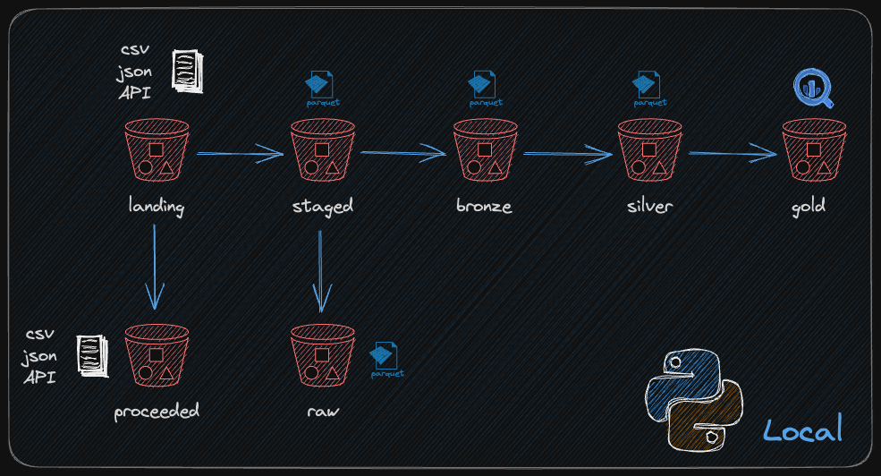
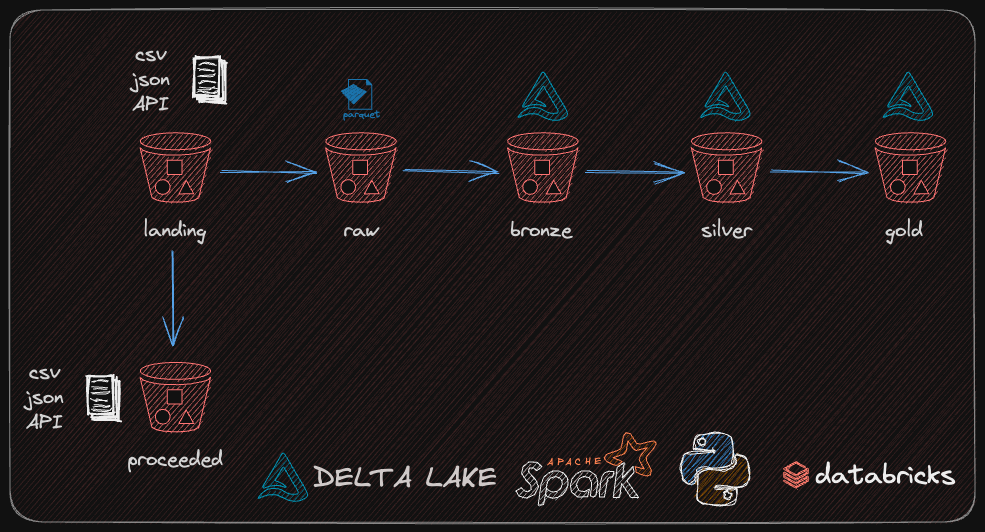

# Desafio Eleflow

Autor: Alecsander Guimarães Rodrigues 

[Github](http://github.com/alecsandergr)

[LinkedIn](http://linkedin.com/in/alecsandergr)

## Sumário

- [Resumo](#resumo)
- [Descrição do desafio](#descrição-do-desafio)
- [Dados](#dados)
- [Extras](#extras)

## Resumo

O desafio consiste em atender um novo cliente, a _BigData Airlines_, fazendo a ingestão de dados e preparar algumas tabelas para os cientistas de dados e analistas de dados.

Dessa forma, optou-se por abordar o problema de duas formas. A primeira usando um desenvolvimento mais simples que poderia ser implementado como funções, como a Lambda da AWS, que fariam todo o processo de *pipeline*, mas que ainda necessataria de uma ferramenta de orquestração, como o Airflow, além de um *Data Warehouse* para onde seria feito o envio das camadas *Bronze*, *Silver* e *Gold*. A camada *Gold* para esse primeiro método consistiu na criação das consultas que seriam realizadas para a construção das *views*.

Apesar de responder esse desafio, esse método método pode não ser suficiente se o volume dos dados for muito grande. Pensando nessa possibilidade uma outra abordagem foi realizada usando o Databricks Community e o Spark, que com algumas modificações poderia ser colocada em produção na versão paga.

## Descrição do desafio

- Carregar os dados de VRA
  - Normalizar o cabeçalho para snake case
  - Salvar estes dados
- Carregar dos dados de AIR_CIA
  - Normalizar o cabeçalho para snake case
  - Separar a coluna 'ICAO IATA' em duas colunas, seu conteúdo está separado por espaço e pode não conter o código IATA, caso não contenha o código IATA, deixe o valor nulo.
  - Salvar estes dados
- Criar nova tabela aerodromos
  - Através da [API](https://rapidapi.com/Active-api/api/airport-info/) trazer os aeródramos através do código ICAO presente nos dados de VRA.
  - Salvar estes dados
- Criar as seguintes views (Priorize o uso de SQL para esta parte):
  - Para cada companhia aérea trazer a rota mais utilizada com as seguintes informações:
    - Razão social da companhia aérea
    - Nome Aeroporto de Origem
    - ICAO do aeroporto de origem
    - Estado/UF do aeroporto de origem
    - Nome do Aeroporto de Destino
    - ICAO do Aeroporto de destino
    - Estado/UF do aeroporto de destino
  - Para cada aeroporto trazer a companhia aérea com maior atuação no ano com as seguintes informações:
    - Nome do Aeroporto
    - ICAO do Aeroporto
    - Razão social da Companhia Aérea
    - Quantidade de Rotas à partir daquele aeroporto
    - Quantidade de Rotas com destino àquele aeroporto
    - Quantidade total de pousos e decolagens naquele aeroporto

## Dados

Os dados usados no desafio foram em parte disponibilizados pela Eleflow, sendo o restante extraídos de uma API.

| Fonte       | Tipo de arquivo | Descrição                                          |
| ----------- | :-------------- | -------------------------------------------------- |
| AIR_CIA     | CSV             | contém dados de identificação das companhias áreas |
| VRA         | JSON            | contém registros de voos                           |
| API (icaos) | JSON            | contém os dados dos aeroportos                     |

### Conteúdo

#### AIR_CIA

- Razão Social: string
- ICAO IATA: string
- CNPJ: string
- Atividades Aéreas: string
- Endereço Sede: string
- Telefone: string
- E-Mail: string
- Decisão Operacional: string
- Data Decisão Operacional: string (contém uma data no formato dd/MM/yyyy)
- Validade Operacional: string (contém uma data no formato dd/MM/yyyy)

#### VRA 

- ICAOEmpresaAérea: string
- NúmeroVoo: string
- CódigoAutorização: string
- CódigoTipoLinha: string
- ICAOAeródromoOrigem: string
- ICAOAeródromoDestino: string
- PartidaPrevista: string
- PartidaReal: string
- ChegadaPrevista: string
- ChegadaReal: string
- SituaçãoVoo: string
- CódigoJustificativa: string

#### API 
- id: int
- iata: string
- icao: string
- name: string
- location: string
- street_number: string
- street: string
- city: string
- county: string
- state: string
- country_iso: string
- country: string
- postal_code: string
- phone: string
- latitude: float
- longitude: float
- uct: int
- website: string

Além desses dados, também foi adicionada uma coluna com um *timestamp* em todos os arquivos.

## Solução

O desafio foi feito em um ambiente local e em um ambiente Databricks Community. Os requisitos para a reprodução do projeto estão em [pyproject.toml](pyproject.toml), se possuir o `poetry` instalado basta usar o comando `poetry install` para instalar as dependências em um ambiente virtual. A solução completa pode ser vista em [local](/local/).

A parte do Databricks Community foi feita em um *cluster* do tipo `14.0 (includes Apache Spark 3.5.0, Scala 2.12)`. Foi necessário criar algumas pastas auxiliares, o processo está descrito nos *notebooks* de configurações. Todo o material com a solução pode ser encontrado em [databricks](/databricks/).

## Extras

### Questão 1

Descrever qual estratégia você usaria para ingerir estes dados de forma incremental caso precise capturar esses dados a cada mês?

#### Resposta

Para ingerir os dados de forma incremental, uma opção seria a criação de uma camada adicional no recebimento dos dados, assim teríamos:

- Landing: pasta onde os arquivos totalmente brutos chegam.
- Procedeed: local para onde vão os arquivos no formato original após processados.
- Staged: local para onde vão os arquivos com modificações simples, como a mudança do cabeçalho. Também pode ser feita a mudança do tipo de arquivo.
- Raw: local em que os arquivos que já foram adicionados à tabela permanecem para uma eventual consulta.
    
Todos os arquivos presentes na camada de *landing* ainda devem ser processados e após essa etapa serão salvos na camada de *proceeded*. Caso haja a necessidade de consultar o arquivo no formato original, eles podem ser lidos com facilidade. 
Os arquivos presentes na pasta *staged* ainda devem ser consolidados em uma única tabela.

Além disso, ao combinar os arquivos deve-se saber a(s) chave(s) primária(s) da tabela para a realização de um *upsert* da tabela, pois o dado a ser inserido pode ser tanto uma atualização de um já presente ou realmente ainda não existir, também é necessário ter uma coluna de ordenação, como um *timestamp*. 

Uma alternativa à camada de *loaded* é o uso Spark Streaming, ele consegue fazer a identificação por meio de metadados quais arquivos já foram processados para a tabela e pode ser feito de maneira fácil por meio do Databricks.

### Questão 2

- Justifique em cada etapa sobre a escalabilidade da tecnologia utilizada.

#### Resposta

O pandas é uma ferramenta que trabalha bem para pequenos *datasets*, se precisarmos fazer a leitura de dados que não cabem na memória uma boa alternativa é o Spark que também oferece computação distribuída e outras vantagens. 

Dessa forma, caso haja a necessidade de escalar o projeto, o pandas deixa de ser uma boa alternativa e pode-se trabalhar com o Spark no Databricks, por exemplo.

### Questão 3

- Justifique as camadas utilizadas durante o processo de ingestão até a disponibilização dos dados.

#### Resposta

- Camada *landing*: local em em que os arquivos são recebidos e permite junto com as camadas *proceeded* e *loaded* a evolução dos arquivos até a consolidação em uma única tabela.
- Camada *proceeded*: local em que os arquivos originais ficam após serem processados.
- Camada *staged*: diretório dos arquivos que não ainda não foram consolidados.
- Camada *raw*: local em que os arquivos ficam após serem consolidados em uma tabela. Além disso, serve como um local de *backup* para os dados.

As quatro primeiras compreendem apenas a movimentação do arquivo até ser consolidado em uma tabela.

- Camada *bronze*: É o primeiro local que os dados estão disponiveís em uma tabela. Permite que os analistas possam ter um primeiro contato com os dados. Contudo, nessa camada eles ainda estão brutos e não modificados, estão apenas consoldidados.
- Camada *silver*: Aqui as regras de negócio devem ser aplicadas, bem como as limpezas necessárias, incluindo adição e remoção de colunas.
- Camada *gold*: Voltada para a pessoa analista, contém apenas as informações necessárias para a resolução do problema do negócio.

